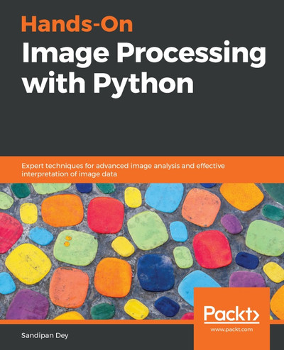

+++
date = '2025-10-15'
draft = false
title = 'Fundamentals of Image Processing for Analytics'
weight = 80
numsession = 8
+++
This session introduces the foundational concepts and practical tools used in digital image processing as they relate to data analytics. 
<!-- more -->
We will explore how images are represented as arrays of pixel intensity values and learn about key color spaces such as RGB, HSV, and Lab, understanding their practical significance for different analytic tasks. The session will cover fundamental image transformations, including scaling, rotation, translation, as well as affine and perspective transformations, enabling students to manipulate and standardize images in preparation for analysis. 

Essential concepts of filtering using convolution, noise reduction, and enhancement through smoothing and sharpening filters will be demonstrated, alongside edge detection using techniques like Sobel, Laplacian, and Canny filters. Feature detection methods, such as extracting corners with the Harris detector and lines through the Hough transform, will be presented.

We cover libraries like OpenCV and scikit-image to gain practical experience analyzing and manipulating images and extracting interpretable features.

## Required Reading and Listening

Listen to the podcast:
<ol>
<li> Brief Overview 
<audio controls>
    <source src="https://insight-gsu-edu-msa8700-public-files-us-east-1.s3.us-east-1.amazonaws.com/podcast/Pixels_to_Power__Mastering_the_Core_Tools_of_Digital_Image_Proc.m4a" type="audio/m4a">
    Your browser does not support the audio element.
</audio>
</li>
<li> Deep Dive 
<audio controls>
    <source src="https://insight-gsu-edu-msa8700-public-files-us-east-1.s3.us-east-1.amazonaws.com/podcast/From_Pixels_to_Features__The_Deep_Dive_into_Machine_Vision%2C_Col.m4a" type="audio/m4a">
    Your browser does not support the audio element.
</audio>
</li>
</ol>

## Textbooks: 
 - [Hands-On Image Processing with Python](https://go.oreilly.com/georgia-state-university/library/view/hands-on-image-processing/9781789343731/)
By Sandipan Dey, Packt Publishing, November 2018. [(GitHub)](https://github.com/PacktPublishing/Hands-On-Image-Processing-with-Python)
- [Mastering OpenCV 4 with Python](https://go.oreilly.com/georgia-state-university/library/view/mastering-opencv-4/9781789344912/)
By Alberto Fernández Villán, Packt Publishing, March 2019. [(GitHub)](https://github.com/PacktPublishing/Mastering-OpenCV-4-with-Python)
- [Python Image Processing Cookbook](https://go.oreilly.com/georgia-state-university/library/view/python-image-processing/9781789537147/)
By Sandipan Dey, Packt Publishing, April 2020. [(GitHub)](https://github.com/PacktPublishing/Python-Image-Processing-Cookbook)
- [Feature Extraction and Image Processing for Computer Vision, 4th Edition](https://go.oreilly.com/georgia-state-university/library/view/feature-extraction-and/9780128149775/)
By Mark Nixon, Alberto Aguado, Academic Press, November 2019.

