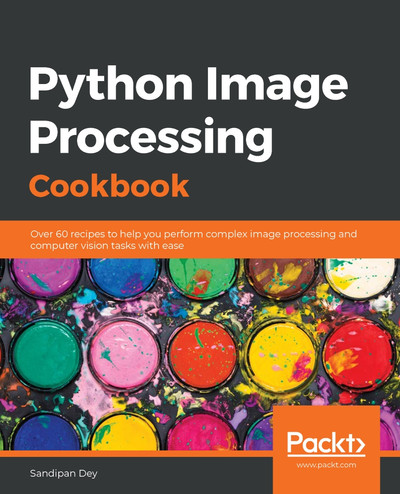

+++
date = '2025-10-29'
draft = false
title = 'Deep Learning for Computer Vision'
weight = 100
numsession = 10
+++
This session introduces students to deep learning approaches that have revolutionized computer vision tasks.

Students will examine the evolution of convolutional neural network (CNN) architectures, starting from earlier networks like LeNet and AlexNet, and progressing to more sophisticated models such as ResNet and EfficientNet. They will learn how to leverage transfer learning by fine-tuning pre-trained models—trained on large-scale datasets like ImageNet—for specialized image classification tasks in data analytics. The session delves into the mechanics and architectures of modern object detection methods, including the R-CNN family, Single Shot Detector (SSD), and the increasingly popular YOLO (You Only Look Once) frameworks.

Special attention will be given to the YOLO model’s structure, bounding box regression, and its advantages for real-time analytics. In parallel, students will explore a range of image augmentation strategies—such as geometric transformations, color jitter, and advanced techniques like CutOut and MixUp—which are vital for enhancing the robustness and generalization of deep learning models when labeled data is scarce.

Through practical implementation, students will train and evaluate deep detection models, compare their performance with classical methods, and gain valuable experience in state-of-the-art computer vision workflows.

## Required Reading and Listening

<!-- Listen to the [podcast](../../podcasts/podcast-10-symbolic-ai/): -->

<!-- Listen to the podcast: -->

<!-- <audio controls>
    <source src="https://insight-gsu-edu-msa8700-public-files-us-east-1.s3.us-east-1.amazonaws.com/podcast/Neuro-Symbolic_AI_Blending_Neural_Networks_and_Symbolic_Reasoning.wav" type="audio/wav">
    Your browser does not support the audio element.
</audio> -->

## Textbooks: 
 - [Hands-On Image Processing with Python](https://go.oreilly.com/georgia-state-university/library/view/hands-on-image-processing/9781789343731/)
By Sandipan Dey, Packt Publishing, November 2018. [(GitHub)](https://github.com/PacktPublishing/Hands-On-Image-Processing-with-Python)
- [Mastering OpenCV 4 with Python](https://go.oreilly.com/georgia-state-university/library/view/mastering-opencv-4/9781789344912/)
By Alberto Fernández Villán, Packt Publishing, March 2019. [(GitHub)](https://github.com/PacktPublishing/Mastering-OpenCV-4-with-Python)
- [Python Image Processing Cookbook](https://go.oreilly.com/georgia-state-university/library/view/python-image-processing/9781789537147/)
By Sandipan Dey, Packt Publishing, April 2020. [(GitHub)](https://github.com/PacktPublishing/Python-Image-Processing-Cookbook)
- [Feature Extraction and Image Processing for Computer Vision, 4th Edition](https://go.oreilly.com/georgia-state-university/library/view/feature-extraction-and/9780128149775/)
By Mark Nixon, Alberto Aguado, Academic Press, November 2019.

